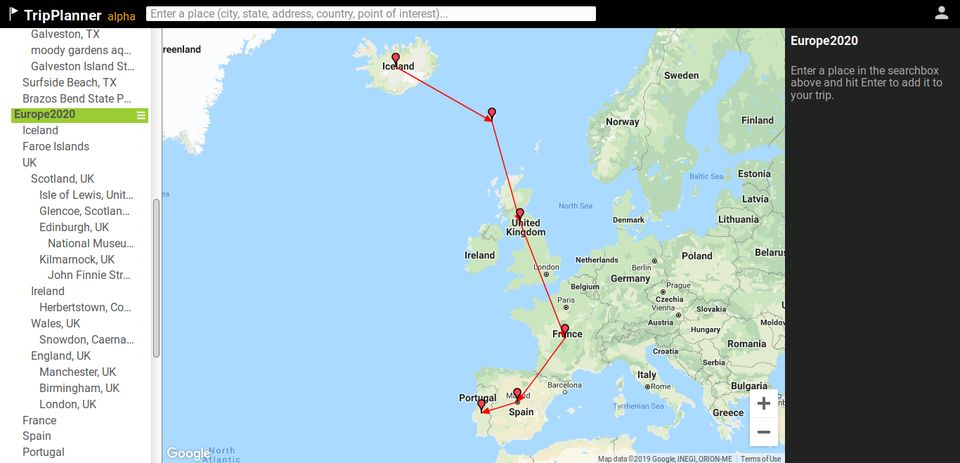

# TripPlanner

A simple trip planner

## Goals

- create any number of trips at top level
- add places by entering names or clicking on map
- drag and drop places to rearrange order, or create hierarchies
- allow hierarchical composition of trip places so can plan high level and low level views
- see information about selected place - from Google Maps, TripAdvisor, etc.
- store notes about trips and places
- see data in tree view, grid view, or document view - editable in all three
- build neomem as a generic graph database

## Available Scripts

This project is built with [Vite](https://vite.dev/) (migrated from create-react-app). In the project directory, you can run:

### `pnpm dev`

Runs the app in development mode with hot module replacement. 
Open [http://localhost:3000](http://localhost:3000) to view it in the browser (Vite picks the next free port if 3000 is taken).

`pnpm start` is kept as an alias for `pnpm dev`.

### `pnpm build`

Builds the app for production to the `build` folder. 
The output is minified with hashed filenames, ready to deploy (Firebase Hosting serves from `build`).

### `pnpm preview`

Serves the production `build` locally so you can sanity-check it before deploying.

### `pnpm test`

Runs the [Mocha](https://mochajs.org/) test suite once (`src/**/test.ts`, via ts-node). 
Use `pnpm test-mocha` for the same suite in interactive watch mode.
